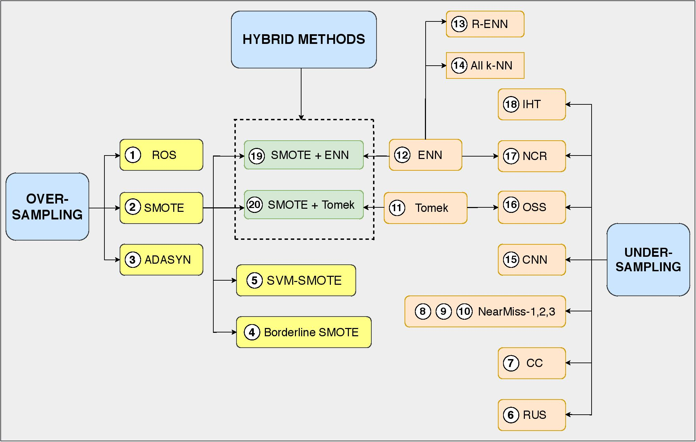

# Aided-Selection-of-Sampling-Methods-for-Imbalanced-Data-Classification


## List of files
* data_creation.py -> create synthetic datasets
* data_resampling.py -> apply resampling methods on the imbalanced datasets
* meta_features_generate.py -> generate meta-features for each dataset
* classifier_predictions.py -> calculates probability predictions for resampled data
* prediction_recall_classifier_predictions.py -> calculates precision-recall measures from probability predictions
* generate_bootstrap_samples.py -> creates bootstrap samples: X (meta-features) & Y (precision-recall measures)


## Usage

### Input Format

### Output format


## Framework of the Architecture

1.  Synthetic Data Creation

```
Create synthetic datasets using the parameters from make_classification python package as given below in the table: 
```
<center>

Metrics | Values |
--- | --- | 
 Samples per data set   | 1000  | 
 Flip fraction (noise level) | 0, 0.002, 0.004, 0.006, 0.008, 0.01 |  
 Number of features (n)  | 4, 6, 8, 9, 10, 11, 13, 15 | 
 Informative features | n-2, n-1, n  |
 Class separation | 0.3, 0.65, 1.0, 1.35, 1.7 |
 Number of clusters per class | 1, 2 for n = 4 and 1, 2, 3 for rest |
 Number of classes | 2|
 Imbalance ratio between the two classes | 0.9:0.1, 0.8:0.2, 0.7:0.3, 0.6:0.4 |
 
</center>
 
 2.  Re-sampling of the imbalanced datasets
 
 ```
 The imbalanced datasets are resampld using the 20 sampling methods we have taken as described in the figure below:

 ```
 
 
 
 3. Calculate precision-recall values from classifiers 
 
 
 The classifiers predict precision and recall scores for all the re-sampled synthetic datasets generated. These precision-recall values act as target values(Y) for the main regressor model of our architecture.
 
 
 
 4. Generate meta-features for each dataset
 
 
 We use 8 meta-features, wherein 7 of them are data-characterising measures and the 8th one is the probability threshold. These meta-features act as training data (X) for the regressor model.
 


<center>
 
Meta- features | 
--- |  
Linear Separability |
Number of hyper-spheres |
Samples per hyper-sphere |
Number of inter-class connections |
Decision boundary complexity  |
Inter-class distance |
Volume of overlap region |
Probability threshold |

</center>
 
5. Regressor Model

We train the regressor model using meta-features(X) and observed precision-recall scores (Y). The trained regressor model takes as input, meta-features from any dataset and outputs predicted precision & recall scores for all the combinations of sampling method and probability threshold.

